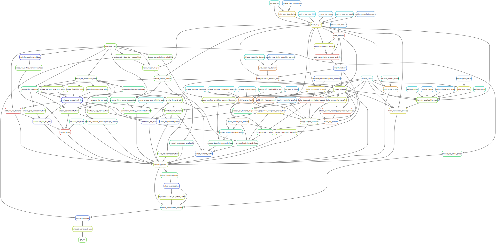

..
  SPDX-FileCopyrightText: Contributors to PyPSA-Eur <https://github.com/pypsa/pypsa-eur>
  SPDX-FileCopyrightText: gb-dispatch-model contributors

  SPDX-License-Identifier: CC-BY-4.0

##################################################################################
gb-dispatch-model: Great Britain dispatch model built on the PyPSA-Eur workflow
##################################################################################

About
=====

gb-dispatch-model is an extension of `PyPSA-Eur <../pypsa_eur.html>`_., used to quantify dispatch decisions in Great Britain under the conditions set out by the UK Future Energy Scenarios.

Quick start
===========

First, follow our :ref:`installation steps <gb_installation>`.

You can then run the full workflow by calling:

.. code:: bash

   pixi run model

This will run all the data processing and dispatch (unconstrained) + redispatch (constrained) optimisation steps using the default GB configuration.

The optimisation steps are the most resource intensive parts of the process.
To run only the data processing steps, call:

.. code:: bash

   pixi run compose_networks

To run the optimisation steps but with a simplified network (namely, with a coarser time dimension to create a smaller optimisation problem), call:

.. code:: bash

   pixi run model --configfile 'config/config.gb.time-segment.yaml'

You can further aggregate the time dimension by updating the content of ``config/config.gb.time-segment.yaml``, considering the available `PyPSA options <https://docs.pypsa.org/latest/examples/time-series-aggregation>`_.

Workflow
========

The full workflow rulegraph is shown below.
Open the image in a new tab/window to view it in more detail.

.. note::
    The graph above was generated using
    ``snakemake --rulegraph -F | sed -n "/digraph/,/}/p" | dot -Tsvg -o doc/gb-model/img/workflow.svg``

Operating Systems
=================

The gb-dispatch-model workflow is continuously tested for Linux, macOS and Windows (WSL only).

.. toctree::
   :hidden:
   :maxdepth: 2
   :caption: Configuration

   installation
   configuration

.. toctree::
   :hidden:
   :maxdepth: 2
   :caption: Development

   system
   dispatch_redispatch
   implementation

.. toctree::
   :hidden:
   :maxdepth: 2
   :caption: References

   release_notes
   data_sources
   ../pypsa_eur